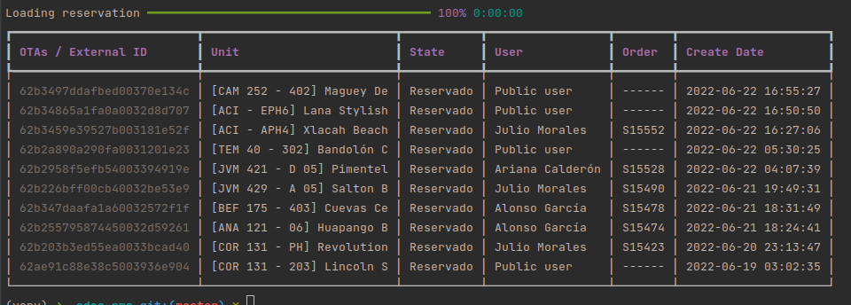

# Install

```bash
# ----- Setup a python virtual env (optional)
python3 -m venv env
source env/bin/activate
# ----- Clone and install
git clone https://github.com/JorgeJuarezCasai/odoo-cli.git
cd odoo-cli
pip install .
```

# Configure

```bash
nano ~/.odoo-config
```

```ini
; Example ~/.odoo-config
odoo_host = 127.0.0.0
odoo_user = admin
odoo_password = admin
odoo_port = 8069
odoo_protocol = jsonrpc
```

# Usage examples
```bash
odoo-pms reservations get-list --states Reservado
```


# Help
## Any command has a help argument "--help"
```bash
odoo-pms --help
```
